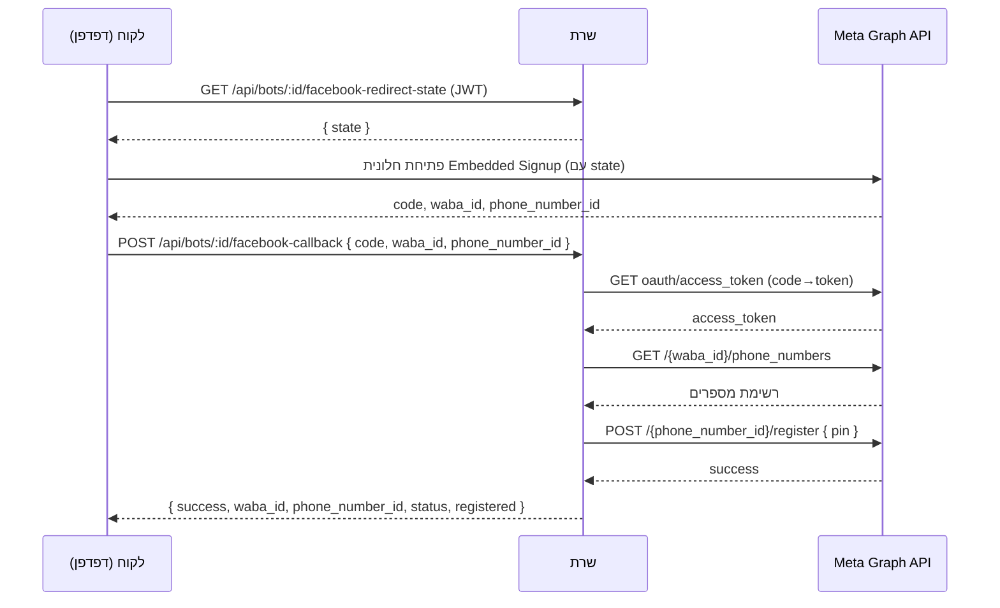

# סיכום קריאות API — התחברות (Login) וחיבור לפייסבוק (Facebook Connect)

מסמך זה מסכם את כל נקודות הקצה (endpoints) הקשורות ל־**התחברות משתמשים** ול־**חיבור בוט לוואטסאפ/פייסבוק דרך Embedded Signup**, כפי שהן מוגדרות בפועל בקוד השרת.

- קבצי מקור: `backend/routes/authRoutes.js`, `backend/controllers/authController.js`, `backend/routes/botRoutes.js`, `backend/controllers/botController.js`
- Base URL לדוגמה: `https://<domain>/api`

---

## חלק א' — התחברות (Login / Auth)

### 1. `POST /api/auth/register` — הרשמה
**Auth:** לא נדרש

**Body:**
```json
{
  "businessName": "שם העסק",
  "phone": "0501234567",
  "email": "user@example.com",
  "password": "123456"
}
```

**תגובה (200):** אובייקט `token` + `user` (זהה במבנה לתגובת login).

**תגובה (409):** אימייל כבר קיים במערכת.

---

### 2. `POST /api/auth/login` — התחברות באימייל וסיסמה
**Auth:** לא נדרש

**Body:**
```json
{
  "email": "user@example.com",
  "password": "123456",
  "accountId": "אופציונלי — כאשר יש כמה חשבונות עם אותו אימייל"
}
```

**לוגיקה:**
- מחפש את כל המשתמשים עם אותו `email`.
- בודק סיסמה מול כל מועמד (תומך גם ב־bcrypt hash וגם בסיסמאות legacy בטקסט רגיל).
- אם יש התאמה יחידה — מתחבר. אם יש כמה — מחזיר `409` עם `requiresAccountSelection: true` ורשימת חשבונות לבחירה (יש לשלוח שוב עם `accountId`).
- למשתמשי `rep`/`rep_manager` — הסטטוס מתעדכן אוטומטית ל־`available`.

**תגובה (200):**
```json
{
  "token": "<JWT, תוקף 24h>",
  "user": {
    "id": "...", "name": "...", "email": "...", "role": "...",
    "manager_id": null, "public_id": "...", "account_type": "Basic",
    "status": "active", "availability_status": "unavailable",
    "trial_expires_at": null, "api_token": "...",
    "user_type_id": null, "permissions": { }
  }
}
```

**תגובה (401):** `{ "error": "Invalid credentials" }`

**תגובה (409):** בחירת חשבון נדרשת (`requiresAccountSelection`).

---

### 3. `POST /api/auth/phone/start` — התחברות בטלפון, שלב 1 (שליחת קוד)
**Auth:** לא נדרש

**Body:** `{ "phone": "0501234567" }`

**לוגיקה:** מאתר משתמשים לפי מספר טלפון, בודק הגבלת קצב (מקסימום 3 בקשות ב־10 דקות), יוצר קוד בן 6 ספרות ושולח אותו **בהודעת וואטסאפ**. הקוד בתוקף ל־5 דקות.

**תגובה (200):** `{ "ok": true }`
**תגובה (404):** מספר לא רשום. **תגובה (429):** יותר מדי בקשות.

---

### 4. `POST /api/auth/phone/verify` — התחברות בטלפון, שלב 2 (אימות קוד)
**Auth:** לא נדרש

**Body:**
```json
{ "phone": "0501234567", "code": "123456", "accountId": "אופציונלי" }
```

**לוגיקה:** מאמת את הקוד (השוואה בטוחה ל-timing, מקסימום 5 ניסיונות), ואז מנפיק JWT — מבנה תגובה זהה ל־`login`. תומך גם ב־`409 requiresAccountSelection` אם יש כמה חשבונות לאותו טלפון.

**תגובה (200):** זהה למבנה `login`. **תגובה (400):** קוד שגוי/פג תוקף.

---

### 5. `POST /api/auth/google` — התחברות/הרשמה עם Google
**Auth:** לא נדרש

**Body:** `{ "credential": "<Google ID token>", "accountId": "אופציונלי" }`

**לוגיקה:** מאמת את ה־ID token מול Google, מוצא/יוצר משתמש לפי אימייל (משתמש חדש מקבל חודש ניסיון), מנפיק JWT זהה במבנה ל־login.

**תגובה (200):** זהה למבנה `login`. **תגובה (401):** `{ "error": "אימות גוגל נכשל, נסה שנית" }`.

---

### נקודות קצה נוספות בתחום האימות (טבלה מקוצרת)

| Method | Path | Auth | תיאור |
|---|---|---|---|
| GET | `/api/auth/check-email` | לא | בדיקה אם אימייל קיים במערכת |
| GET | `/api/auth/accounts-for-email` | לא | רשימת חשבונות קלה למסך בחירת חשבון לפני login |
| GET | `/api/auth/invite/verify` | לא | אימות טוקן הזמנה |
| POST | `/api/auth/invite/register` | לא | הרשמה דרך הזמנה |
| POST | `/api/auth/invite/google` | לא | הרשמה דרך הזמנה + Google |
| GET | `/api/auth/api-token` | כן (JWT) | קבלת טוקן API לוואטסאפ |
| GET | `/api/auth/templates` | כן (JWT) | קבלת תבניות Dialog360 |
| PUT | `/api/auth/dialog360-credentials` | כן (JWT) | עדכון פרטי חיבור Dialog360 |
| GET | `/api/auth/profile` | כן (JWT) | פרופיל מלא של המשתמש המחובר |
| PATCH | `/api/auth/profile` | כן (JWT) | עדכון פרופיל |
| PATCH | `/api/auth/availability` | כן (JWT) | עדכון סטטוס זמינות |
| POST | `/api/auth/logout` | כן (JWT) | סימון "לא זמין" ביציאה |
| GET/PUT | `/api/auth/removal-config` | כן (JWT) | הגדרות הסרה אוטומטית |
| GET | `/api/auth/my-accounts` | כן (JWT) | חשבונות אחים לאותו אימייל |
| POST | `/api/auth/switch-account` | כן (JWT) | מעבר עצמאי לחשבון אח |

> **הרשאה:** בכל נקודת קצה שמסומנת "כן (JWT)" יש לשלוח כותרת `Authorization: Bearer <token>` עם הטוקן שהתקבל מ־login/register/google/phone-verify.

---

## חלק ב' — חיבור לפייסבוק / וואטסאפ (Embedded Signup)

כל נקודות הקצה הבאות נמצאות תחת `backend/routes/botRoutes.js` (בסיס: `/api/bots`) והמימוש ב־`backend/controllers/botController.js`. תהליך החיבור בפועל מתבצע בצד הלקוח (חלונית OAuth של Meta), והשרת מקבל את התוצאה בקריאות הבאות.

### 1. `POST /api/bots/:id/connect-facebook`
**Auth:** כן (JWT)

נקודת קצה ישנה/legacy — כיום **no-op**: פשוט מאשרת שהחיבור עבר לחלונית הלקוח.

**תגובה (200):** `{ "success": true, "mode": "client-popup" }`

---

### 2. `GET /api/bots/:id/facebook-redirect-state`
**Auth:** כן (JWT)

מנפיקה טוקן `state` חתום (JWT קצר-מועד, תוקף 2 שעות) המכיל `{ botId, userId }`, שמועבר ל־Meta כפרמטר `state` בתהליך ה-OAuth, כדי שנקודת הקצה הציבורית `facebook-redirect` תדע לזהות את הבוט.

**תגובה (200):** `{ "success": true, "state": "<jwt>" }`

### 2ב. `GET /api/bots/facebook-redirect-state-free`
**Auth:** כן (JWT)

זהה לעיל, אך **ללא בוט ספציפי** — המספר שיתקבל יישמר תחת `user.connected_numbers` (לא משויך) לשיוך מאוחר יותר.

**תגובה (200):** `{ "success": true, "state": "<jwt, botId=null>" }`

---

### 3. `POST /api/bots/:id/facebook-callback` — הקריאה המרכזית של תהליך החיבור
**Auth:** כן (JWT)

מתקבלת מהדפדפן לאחר סיום חלונית ה-Embedded Signup של פייסבוק/מטא.

**Body צפוי:**
```json
{
  "code": "<authorization code מ-Meta>",
  "waba_id": "403059862884906",
  "phone_number_id": "403206936201771",
  "client_id": "אופציונלי",
  "currentStep": "אופציונלי",
  "action": "completed",
  "error_message": "אופציונלי"
}
```

**שלבי עיבוד בשרת:**
1. **החלפת code ← access_token** ארוך טווח:
   `GET https://graph.facebook.com/{FB_GRAPH_VERSION}/oauth/access_token?client_id=...&client_secret=...&code=...`
2. **שליפת מספרי טלפון** תחת ה־WABA:
   `GET https://graph.facebook.com/{ver}/{waba_id}/phone_numbers?fields=id,verified_name,display_phone_number,quality_rating,status,code_verification_status,name_status,messaging_limit_tier&access_token=...`
3. **שמירה** במסמך ה־`BotFlow` (waba_id, phone_number_id, access_token, display_phone_number, quality_rating, status וכו').
4. **רישום/הפעלה אוטומטית** של המספר ב-Cloud API:
   `POST https://graph.facebook.com/{ver}/{phone_number_id}/register`
   Body: `{ "messaging_product": "whatsapp", "pin": "<6-ספרות>" }`

**דורש משתני סביבה בשרת:** `FB_APP_ID`, `FB_APP_SECRET`, `FB_GRAPH_VERSION` (ברירת מחדל `v20.0`).

**תגובה (200):**
```json
{
  "success": true,
  "bot_id": "...",
  "waba_id": "...",
  "phone_number_id": "...",
  "display_phone_number": "...",
  "verified_name": "...",
  "quality_rating": "...",
  "status": "...",
  "code_verification_status": "...",
  "name_status": "...",
  "messaging_limit_tier": "...",
  "token_type": "bearer",
  "expires_in": 5184000,
  "phones_count": 1,
  "phones": [ /* מערך כל מספרי הטלפון תחת ה-WABA */ ],
  "registered": true,
  "register_response": { }
}
```

**שגיאות אפשריות:** `400 missing_code`, `404 Bot not found`, `500 server_not_configured` (חסרים FB_APP_ID/FB_APP_SECRET), `502 token_exchange_failed`.

---

### 4. `POST /api/bots/:id/facebook-ingest` — הזנה ידנית של JSON ממטא (עוקף שלב ה-OAuth)
**Auth:** כן (JWT)

מיועד למקרים בהם כבר יש JSON גולמי ממטא (id/phone_number_id, waba_id וכו') ורוצים לדלג על שלב 1 (החלפת code).

**Body:**
```json
{
  "id": "403206936201771",
  "waba_id": "403059862884906",
  "wabaName": "Ohad's Bots",
  "verified_name": "Ohad's Bots",
  "display_phone_number": "+972 73-332-8792",
  "quality_rating": "UNKNOWN",
  "status": "PENDING",
  "code_verification_status": "EXPIRED",
  "name_status": "DECLINED",
  "access_token": "אופציונלי — עוקף טוקן שמור/env",
  "pin": "אופציונלי, 6 ספרות"
}
```

**סדר עדיפויות לטוקן גישה:** `body.access_token` → `bot.whatsapp_access_token` השמור → `process.env.META_SYSTEM_USER_TOKEN`.

מבצע שמירה + קריאה ל-`/register` (זהה לשלב 4 ב-callback לעיל).

**תגובה (200):**
```json
{
  "success": true, "bot_id": "...", "waba_id": "...", "phone_number_id": "...",
  "display_phone_number": "...", "verified_name": "...", "status": "CONNECTED",
  "registered": true, "pin": "123456", "register_response": { }
}
```

**שגיאות:** `400 missing_phone_number_id`, `400 missing_access_token`, `404 Bot not found`.

---

### 5. `GET /api/bots/facebook-redirect` — נקודת קצה ציבורית (ללא צורך ב-Authorization header)
**Auth:** לא (האימות מגיע דרך פרמטר `state` החתום)

זהו ה־`redirect_uri` שאליו מטא מפנה את הדפדפן בסיום ה-Embedded Signup (חלופה ל-callback לעיל, לזרימה מבוססת redirect ולא popup+postMessage).

**Query params:** `?code=...&state=...` (או `error`, `error_description`, `error_reason` במקרה כשלון).

**לוגיקה:** מאמת את ה־`state` (JWT), ואז מריץ את אותה שרשרת שלבים כמו `facebook-callback` (החלפת code, שליפת מספרים, רישום), ומחזיר **דף HTML** שסוגר את עצמו ושולח `postMessage` להורה עם התוצאה (`{ event: 'fb-redirect-done', ok, ... }`), כולל תצוגת JSON ויזואלית למשתמש.

---

## תרשים זרימה — חיבור פייסבוק/וואטסאפ



---

## הערות אבטחה
- כל נקודות הקצה המסומנות "Auth: כן (JWT)" דורשות `Authorization: Bearer <token>` תקין.
- `facebook-redirect` היא היחידה שאינה דורשת כותרת Authorization — האימות שלה מגיע מטוקן `state` חתום (JWT) בעל תוקף מוגבל (2 שעות), ולכן אין לחשוף את ה-secret של החתימה.
- ה-`access_token` של Meta מוסתר בלוגים (`***`) ולא מוחזר גולמי בתגובות ה-JSON להצגה.
- סיסמאות מאומתות דרך bcrypt (או השוואה ישירה עבור חשבונות legacy) — לפרטים נוספים ראו את קובץ הזיכרון `auth-register-login`.
