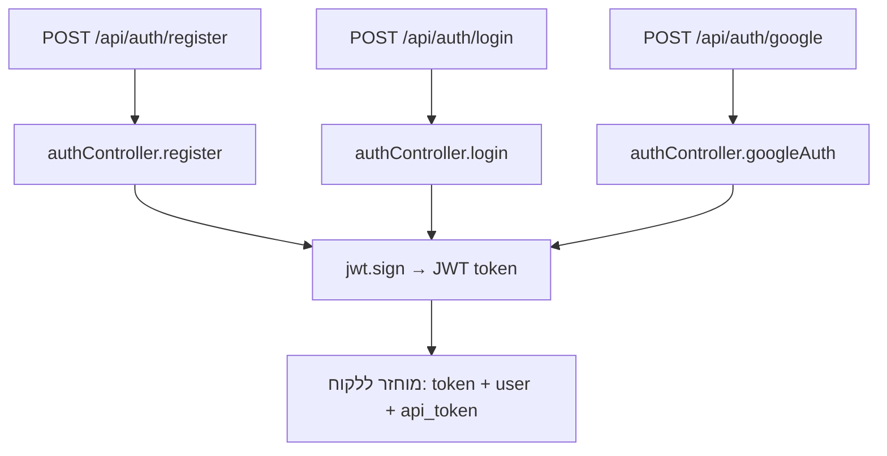

# תיעוד תהליך Authentication — הרשמה, התחברות, Google, ולקוח חדש

מבוסס על:
- backend/controllers/authController.js
- backend/middleware/auth.js
- backend/routes/authRoutes.js
- backend/models/User.js

## מבנה כללי



כל שלושת ה-endpoints (register, login, google) מחזירים אותה צורת תשובה:

```json
{
  "token": "JWT לדשבורד",
  "user": { "...": "...", "api_token": "טוקן קבוע ל-WhatsApp API" }
}
```

---

## 1. הרשמה עם שם וסיסמה — `register`

**Route:** `POST /api/auth/register` (ללא auth middleware, ציבורי)
**קוד:** backend/controllers/authController.js (פונקציה `register`)

שלבים:
1. מקבל `{ name, email, phone, password, role }` מה-body.
2. יוצר `public_id` רנדומלי (`Math.random().toString(36)...`) — לא מזהה קריפטוגרפי חזק, רק מזהה ציבורי.
3. קובע תפקיד (`role`):
   - ברירת מחדל `'user'`.
   - אם ביקשו `role === 'admin'` — מתאפשר רק אם **אין עדיין אדמין במערכת** (`adminCount === 0`) או שהסביבה היא development (`NODE_ENV !== 'production'`). אחרת הבקשה נדחית בשקט (משתמש נוצר כ-`user` רגיל).
4. קובע `trial_expires_at` = חודש קדימה מרגע ההרשמה.
5. יוצר את המשתמש ב-Mongo: `User.create({ name, email, phone, password, role, public_id, account_type: 'Trial', status: 'active', trial_expires_at })`.
   - **הערה חשובה:** הסיסמה נשמרת **כפי שהיא (plain text)** — אין hashing (bcrypt/argon2) בשום מקום בסכמה או בקונטרולר.
6. יוצר JWT: `jwt.sign({ id: userId, email }, SECRET_KEY, { expiresIn: '24h' })` — שימו לב שב-register ה-payload מכיל **רק** `id` ו-`email` (לא `role`/`manager_id`/`user_type_id` כמו ב-login).
7. מחזיר תשובה עם `token` (JWT), ופרטי המשתמש כולל `api_token: user.token`.

**נקודה קריטית:** אין קוד שמייצר בפועל ערך ל-`user.token` (ה-API token ל-WhatsApp) בזמן ההרשמה. שדה `token` בסכמה הוא `sparse/unique` בלי ברירת מחדל ובלי `pre('save')` hook שממלא אותו. כלומר `api_token` שמוחזר בפועל הוא `undefined` עד שמישהו מריץ סקריפט ידני. זה **סותר** את התיעוד הקיים ב-backend/AUTO-TOKEN-SYSTEM.md שטוען שהטוקן נוצר אוטומטית. הסקריפטים היחידים שמייצרים אותו בפועל:
   - backend/add-token.js — `crypto.randomBytes(32).toString('hex')`
   - backend/add-tokens-to-users.js
   - backend/update-tokens.js

   כלומר צריך להריץ אחד מהם ידנית כדי שלמשתמש חדש יהיה `api_token` תקין ל-WhatsApp API.

---

## 2. התחברות עם מייל וסיסמה — `login`

**Route:** `POST /api/auth/login`
**קוד:** backend/controllers/authController.js (פונקציה `login`)

שלבים:
1. מחפש את **כל** המשתמשים עם `email` ו-`password` תואמים (`User.find`, לא `findOne`) — כי המערכת תומכת בכמה חשבונות (חברות) עם אותו מייל.
   - השוואת הסיסמה נעשית ישירות מול הערך במסד (`password` שמור plain text).
2. אם 0 תוצאות → `401 Invalid credentials`.
3. אם תוצאה אחת → זה המשתמש.
4. אם כמה תוצאות (כמה חשבונות עם אותו מייל+סיסמה):
   - אם נשלח `accountId` בבקשה — מאתר את המשתמש המתאים לפי `_id`.
   - אחרת מחזיר `409` עם `requiresAccountSelection: true` ורשימת חשבונות (`id`, `name`, `account_type`, `role`, `created_at`) — כדי שה-frontend יציג "בחר חשבון" וישלח שוב login עם `accountId`.
5. אם ה-role הוא `rep`/`rep_manager` — מאפס `availability_status` ל-`'available'`.
6. בונה JWT: `jwt.sign({ id, email, role, manager_id, user_type_id }, SECRET_KEY, { expiresIn: '24h' })`.
7. מחשב `permissions` דרך `resolvePermissions(user)`.
8. מחזיר `token` + אובייקט `user` מלא (כולל `api_token: user.token`, `permissions`, `account_type`, `status` וכו').

---

## 3. התחברות/הרשמה עם Google — `googleAuth`

**Route:** `POST /api/auth/google`
**קוד:** backend/controllers/authController.js (פונקציה `googleAuth`)

שלבים:
1. מקבל `credential` (Google ID Token) מהלקוח (ואפשר גם `accountId` לבחירת חשבון).
2. מאמת את ה-token מול Google: `googleClient.verifyIdToken({ idToken: credential, audience: process.env.GOOGLE_CLIENT_ID })` (ספריית `google-auth-library`).
3. שולף מה-`payload`: `email`, `name`, `sub` (= `googleId`).
4. מחפש משתמשים לפי `email` (case-insensitive, `toLowerCase`):
   - **0 תוצאות** → יוצר משתמש חדש (**"לקוח חדש"**): `User.create({ name, email, googleId, public_id, account_type: 'Trial', status: 'active', trial_expires_at })`. אין `password` בכלל — המשתמש מזוהה רק דרך Google.
   - **תוצאה אחת** → אם למשתמש עדיין אין `googleId` שמור, משייך אותו (`user.googleId = googleId; await user.save()`) — כלומר "קישור" חשבון קיים (שנרשם בעבר עם סיסמה) לחשבון Google.
   - **כמה תוצאות** → כמו ב-login: אם אין `accountId` תואם, מחזיר `requiresAccountSelection: true` + רשימת חשבונות. אחרת ממשיך עם המשתמש שנבחר ומשייך `googleId` אם חסר.
5. איפוס `availability_status` ל-`available` עבור `rep`/`rep_manager`.
6. בניית JWT זהה למבנה ב-login: `{ id, email, role, manager_id, user_type_id }` עם `expiresIn: '24h'`.
7. מחשב `permissions` ומחזיר תשובה זהה במבנה ל-login/register.
8. במקרה כשל אימות מול Google — `401` עם הודעה בעברית "אימות גוגל נכשל, נסה שנית".

---

## 4. "לקוח חדש" ותרחיש ריבוי חשבונות באותו מייל

ה-schema (`User.js`) **לא שם unique על email** בכוונה (`// NOTE: intentionally NOT unique`), כדי לתמוך במספר חשבונות/חברות עם אותה כתובת מייל (למשל דרך Google).

- **register**: יוצר רשומה חדשה גם אם כבר קיים מייל זהה (אין בדיקת ייחודיות ב-register עצמו). יש endpoints נפרדים ל-frontend לבדיקה מראש: `GET /api/auth/check-email`, `GET /api/auth/accounts-for-email`.
- **login/googleAuth**: כשיש כמה משתמשים עם אותו מייל, נדרש `accountId` לבחירה מפורשת (`requiresAccountSelection`).
- לאחר ההתחברות, יש מנגנון החלפת חשבון עצמאי:
  - `GET /api/auth/my-accounts` — מציג "אחים" לאותו מייל.
  - `POST /api/auth/switch-account` — מנפיק JWT חדש לחשבון האחר. בדיקות אבטחה: `mongoose.Types.ObjectId.isValid` על `accountId` (מניעת NoSQL injection) והשוואת email בין החשבונות.

---

## מבנה ה-JWT (Token generation)

**קובץ:** backend/middleware/auth.js

```js
const SECRET_KEY = 'dfghjukiolp;[p0o9i8uytgbhnjmk,l.;p9876543t4rre2asd';
```

- ה-secret **מוגדר קבוע (hardcoded) בקוד**, לא מגיע מ-`.env`. בעיית אבטחה (OWASP A02 — Cryptographic Failures / חשיפת סוד ב-source control).
- ה-payload של ה-JWT:
  - ב-`register`: `{ id, email }` בלבד.
  - ב-`login` / `googleAuth` / `switchAccount`: `{ id, email, role, manager_id, user_type_id }`.
- תוקף: `expiresIn: '24h'` בכל המקומות.
- אין Refresh Token — כשהטוקן פג, המשתמש צריך להתחבר מחדש.

### שני סוגי "טוקן" שחוזרים ללקוח

| שם | מקור | שימוש | תוקף |
|---|---|---|---|
| `token` (JWT) | `jwt.sign(...)` | אימות מול ה-dashboard/API (`Authorization: Bearer`) | 24 שעות |
| `api_token` (= `user.token`) | שדה קבוע ב-DB, נוצר רק ע"י סקריפט ידני (add-token.js וכו') | קריאות חיצוניות ל-WhatsApp API (`get-reply-text?...&token=...`) | קבוע (לא פג) |

### אימות הטוקן ב-middleware

- `authenticateToken` — מאמת JWT בלבד (`jwt.verify`), שם `req.user`, `req.userId`.
- `authenticateJwtOrApiToken` — מנסה קודם JWT, ואם נכשל, מחפש משתמש לפי `User.findOne({ token })` (ה-api_token הקבוע) — כך endpoints חיצוניים יכולים לקבל גם JWT וגם api_token.
- `optionalAuthToken` — אותו דבר אך לא חוסם אם אין טוקן.
- `resolvePermissions(user)` — טוען הרשאות מ-`UserType` (אם `user_type_id` מוגדר) או fallback לפי `role` (`getDefaultPermissionsForRole`).

---

## סיכום בעיות/פערים שכדאי לדעת עליהם

1. **סיסמאות נשמרות plain text** — אין hashing.
2. **SECRET_KEY hardcoded** בקוד ולא ב-environment variable.
3. **api_token לא נוצר אוטומטית** בהרשמה, בניגוד למה שכתוב ב-backend/AUTO-TOKEN-SYSTEM.md — נדרש סקריפט ידני.
4. הרשמה כ-`admin` תלויה רק ב-`NODE_ENV` ובספירת אדמינים קיימים — ללא הרשאת admin קודמת.
